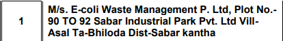

# dear folk hope you find this file for instruction of your task :


#### team is divded into 3 groups 
##### 1 working on data is consist of  member 
<br />

## your task is as follow 

### pls serch the flie that is in attachment we need data of 3 states ie guj , rj ,mh 

## As par your mutual  understanding select the work of each state and one who doesn't had an lap can find the ewaste device list limit 20

# how to perform 
### ie to find the gujarat ewaste search in file with 


above image has city as -Sabarkantha and state as guj
 ```js
 const states = ["Select State","UP", "Delhi", "Gujrat"];

  const cities = {
    UP: ["Select city",,"f", "g", "l"],

    Delhi: ["Select city",,"a", "b"],

    Gujrat: ["Select city",,"tr", "trt", "rtt"],
  };

  const adders ={
    tr: ["Select add",,"tr", "trt", "rtt"],
    trt: ["Select add","tr", "trt", "rtt"],
    rtt: ["Select add",,"tr", "trt", "rtt"],
    f:  ["Select add","f", "g", "l"],
    g:  ["Select add","f", "g", "l"],
    l:  ["Select add","f", "g", "l"],
    a: ["Select add","a", "b"],
  };
  ```
  
  to write above will be 

  const cities =[Gujrat: ["Select city",,"Sabarkantha", "trt", "rtt"]

  and for Aadder =
{
  Sabarkantha:["Select add","M/s. E-coli Waste Management P. Ltd, Plot No.-90 TO 92 Sabar Industrial Park Pvt. Ltd Vill-Asal
 Ta-Bhiloda Dist-Sabar kantha",]
}